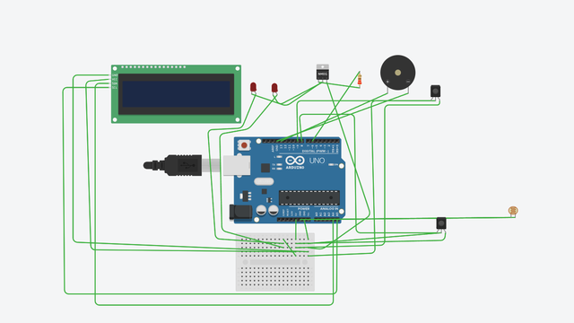

# Automatic Street & Traffic Light System with Over-Speed Detection

An Arduino prototype from a university embedded-systems course. It combines light-dependent street lighting that reacts to vehicles with two-sensor vehicle speed measurement, LCD output and a buzzer alert for overspeeding.



## Overview

The prototype was built to show three ideas on a small scale:

1. **Automatic street lighting.** Lights stay off in daylight, run dimmed at night, and go to full brightness when a vehicle is detected.
2. **Vehicle speed measurement.** Two sensors a fixed distance apart timestamp a passing object, and the firmware works out its speed.
3. **Overspeed alerting.** If the measured speed is over a threshold, the LCD shows a warning and a buzzer sounds.

The constants in the code (sensors 0.2 m apart, a 5 km/h limit, 20 cm detection range) show it was a tabletop scale model, not a roadside installation.

## Features

These features are implemented in the source in this repository:

- Speed measured from the time between two IR sensor triggers (`millis()` timestamps)
- Speed shown in km/h on a 16×2 I2C LCD, labelled "Normal Speed." or "Overspeed detected!!"
- A buzzer that sounds for 3 s when the speed is above the threshold
- A measurement timeout: if the second sensor doesn't trigger within 5 s, the LCD shows "Timeout! / Try again" and the system resets
- Serial Monitor logs of timestamps, time difference, distance and calculated speed
- Street lights switched by ambient light (LDR on an analog input)
- Night-time dimming with PWM (`analogWrite`), and full brightness when a vehicle is detected
- A MOSFET output switched on at night and off in daylight (integrated version)
- A separate lighting experiment that uses three ultrasonic sensors, one per LED, to brighten only the LED nearest the detected object


## System Components

**Referenced directly in the source code:**

| Component | Where used | Notes |
|---|---|---|
| Arduino (Uno per project BOM) | All sketches | |
| IR obstacle sensor modules ×2 | Speed detection, integrated | A code comment names them "MH Flying Fish". Active-LOW output. |
| 16×2 LCD with I2C backpack | Speed detection, integrated | `LiquidCrystal_I2C` library, address `0x27` in the earliest version and `0x3F` later |
| Buzzer | Speed detection, integrated | |
| LDR (photoresistor) | Lighting, integrated | Read with `analogRead(A0)` |
| LEDs | Lighting (3), integrated (2) | Driven with PWM |
| MOSFET | Integrated | Gate on pin 6, switched with `digitalWrite`. The code doesn't say what load it drives. |
| Ultrasonic distance sensors ×3 | Ultrasonic lighting experiment only | TRIG/ECHO interface; module model not named |
| Serial (USB) link | All sketches | `Serial.begin(9600)` for debug output |

**Listed only in the project presentation's bill of materials** (not referenced in code): breadboards, wires, battery, diode, solar panel, charge controller, step-up converter, resistors. See [images/bom_part1.png](images/bom_part1.png) and [images/bom_part2.png](images/bom_part2.png).

## System Architecture

Everything runs in a single polled `loop()` on one Arduino, with no interrupts and no scheduler. In the integrated sketch, each pass through the loop does the following:

```
loop()
 ├─ updateStreetLights()
 │    read LDR ── light? ──► LEDs off, MOSFET off
 │               dark?  ──► LEDs dim (PWM 30), MOSFET on
 │                          └─ IR1 or IR2 LOW? ─► LEDs full on
 │
 ├─ IR1 LOW and idle?            ──► t1 = millis(), state = WAITING
 ├─ IR2 LOW and WAITING?         ──► t2 = millis(), compute speed,
 │                                   LCD + buzzer + serial, hold, reset
 └─ WAITING for more than 5 s?   ──► LCD "Timeout!", reset
```

The presentation's flowchart ([images/flowchart.png](images/flowchart.png)) describes the same intent: sense sunlight, dim to 20% at night, brighten on motion, then check speed and alert. See [docs/architecture.md](docs/architecture.md) for more detail.

## Speed Detection

Two IR sensors are placed `SENSOR_DISTANCE_M = 0.2` m apart. The modules pull their output LOW when an object is in front of them.

1. **First trigger.** When IR1 reads LOW and no measurement is in progress, the firmware stores `t1 = millis()` and sets `firstSensorTriggered`.
2. **Second trigger.** When IR2 reads LOW while waiting, it stores `t2 = millis()` and sets `measurementComplete`.
3. **Elapsed time.** `timeSeconds = (t2 - t1) / 1000.0`. The calculation only runs if `t2 > t1`.
4. **Velocity:**

   ```cpp
   velocity = (DISTANCE / timeSeconds) * 3.6;   // m/s → km/h
   ```

   For example, an object that takes 0.10 s to cover 0.2 m gives (0.2 / 0.10) × 3.6 = 7.2 km/h.
5. **Threshold.** If `velocity > 5.0` km/h, the buzzer turns on and the LCD shows "Overspeed detected!!" with the speed. After 3 s the buzzer turns off. Otherwise the LCD shows "Normal Speed." with the speed.
6. **Reset.** The result stays on screen, then `resetMeasurement()` clears the flags, turns off the buzzer and shows "Ready...".
7. **Timeout.** If IR1 fired but IR2 hasn't fired within `TIMEOUT = 5000` ms, the LCD shows "Timeout! / Try again" for 2 s and the system resets.

The earliest salvaged version (`historical/01_speed_basic.ino`) computed `velocity` on every loop pass without any state flags or timeout. The later versions add the state tracking described above.


**Integrated version** (`src/integrated_system`), which matches the Tinkercad schematic:

- The LDR is read on **A0** every loop, and a value **below 200** is treated as dark.
- When it's dark, LEDs on pins 10 and 11 are set to `analogWrite(…, 30)` (about 12% duty). The MOSFET on pin 6 is switched HIGH.
- If either IR sensor reads LOW (a vehicle is present), both LEDs are set to full brightness with `digitalWrite(HIGH)`.
- When it's light, the LEDs and MOSFET are switched off.
- The MOSFET is HIGH in both dark cases, so it acts as a day/night on-off switch, not a dimmer.

**Ultrasonic version** (`src/smart_lighting`), a separate experiment:

- An LDR value **above 800** is treated as bright, and all LEDs turn off.
- Otherwise all three LEDs idle at `analogWrite(…, 51)` (20% of 255).
- Each LED has its own ultrasonic sensor. Distance is calculated as `duration * 0.034 / 2` cm. The first sensor (in priority order 1→2→3) that reads **20 cm or less** sets its LED to 255 for 5 s.

The two versions use opposite LDR comparisons (`> 800` bright vs `< 200` dark). That is consistent with the LDR divider being wired differently in each build, but the wiring itself isn't recorded.

## Hardware / Pin Configuration

Only pins that appear in the code are listed.

| Pin | Speed detection | Integrated system | Ultrasonic lighting |
|---|---|---|---|
| D2 | – | – | Ultrasonic 1 TRIG |
| D3 | – | – | Ultrasonic 1 ECHO |
| D4 | – | – | Ultrasonic 2 TRIG |
| D5 | – | – | Ultrasonic 2 ECHO |
| D6 | – | MOSFET gate | Ultrasonic 3 TRIG |
| D7 | – | – | Ultrasonic 3 ECHO |
| D8 | IR sensor 1 | IR sensor 1 | – |
| D9 | IR sensor 2 | IR sensor 2 | LED 1 (PWM) |
| D10 | – | LED 1 (PWM) | LED 2 (PWM) |
| D11 | – | LED 2 (PWM) | LED 3 (PWM) |
| D13 | Buzzer | Buzzer | – |
| A0 | – | LDR | LDR |
| I2C | LCD | LCD | – |

The code doesn't set the I2C pins; the `Wire` library uses the board defaults (A4 = SDA, A5 = SCL on an Uno). The Tinkercad schematic shows the LCD's SDA and SCL wired to A4 and A5.

## Software Structure

| Function | Purpose |
|---|---|
| `setup()` | Initialises the LCD, sets pin modes, starts serial at 9600 baud, shows a splash screen and "Ready..." |
| `loop()` | Polls sensors and runs the lighting logic and the speed state machine |
| `printWithDelay(text, col, row)` | Writes to the LCD one character at a time with a 1 ms gap (carried over from the original) |
| `showSpeedOnLcd(headline)` | Writes the headline and speed line. It collects code that was duplicated in the original. |
| `resetMeasurement()` | Clears state flags, turns the buzzer off, shows "Ready..." |
| `updateStreetLights()` | Runs the LDR and IR lighting logic (integrated sketch). It is the original inline block moved into its own function. |
| `readUltrasonic(trig, echo)` | Sends a 10 µs trigger pulse, measures the echo with `pulseIn`, returns cm (ultrasonic sketch) |

The speed detection uses three states, tracked with two booleans:

| State | `firstSensorTriggered` | `measurementComplete` |
|---|---|---|
| Idle / Ready | false | false |
| Waiting for IR2 | true | false |
| Showing result | true | true |

## Repository Layout

```
src/               cleaned, compilable sketches (one folder per sketch, Arduino IDE convention)
historical/        salvaged sketches exactly as recovered, duplicates removed
docs/              architecture notes and source provenance
simulation/        notes on the Tinkercad design
images/            figures taken from the project presentation
```

The cleaned sketches are meant to behave like the originals. [docs/source-provenance.md](docs/source-provenance.md) 

**Build:** open a folder under `src/` in the Arduino IDE, install the *LiquidCrystal I2C* library, select *Arduino Uno*, and compile. All three `src/` sketches were checked to compile for an ATmega328P using avr-gcc 7.3 with the ArduinoCore-avr sources and the johnrickman `LiquidCrystal_I2C` library. They have **not** been re-tested on physical hardware as part of this reconstruction.

## Simulation

The team designed the circuit in **Tinkercad**. The presentation includes a Tinkercad breadboard view and an auto-generated schematic dated 11 March 2025. This repository contains only screenshots of that design ([images/](images/)), not the Tinkercad project itself. See [simulation/README.md](simulation/README.md).


## Team

This was a four-person team project:

- Farhan Islam Ifti
- Amirul Mumin Utshaw
- Eusha Ahmed Mahi
- Asaduzzaman Nur Limon


## Technologies

- C++ (Arduino)
- Arduino Uno / AVR
- I2C (via `Wire` / `LiquidCrystal_I2C`)
- Sensor interfacing: IR obstacle sensors, LDR, ultrasonic (TRIG/ECHO timing with `pulseIn`)
- Digital and analog I/O (`digitalRead/Write`, `analogRead`)
- PWM (`analogWrite`)
- Serial communication (debug logging at 9600 baud)
- Character LCD interfacing
- Tinkercad (circuit design)

## Future Improvements

- Timestamp sensor edges with pin-change or external interrupts, to remove the dependence on loop timing
- Replace `delay()` with non-blocking `millis()`-based timing, so the lights and sensors keep running while results are displayed
- Build an explicit `enum`-based state machine for the speed measurement
- Add debouncing or filtering of the sensor inputs
- Make thresholds configurable (e.g. via serial commands or EEPROM)
- Split the code into sensor and display modules with small driver interfaces
- Fix the LCD layout so the speed value and unit never overlap
- Detect travel direction (either sensor first)
- Treat a `pulseIn` timeout as "no object" in the ultrasonic variant
- Implement the traffic-signal logic described in the presentation
- Validate the speed readings on hardware against a known reference

## License

MIT. See [LICENSE](LICENSE).
